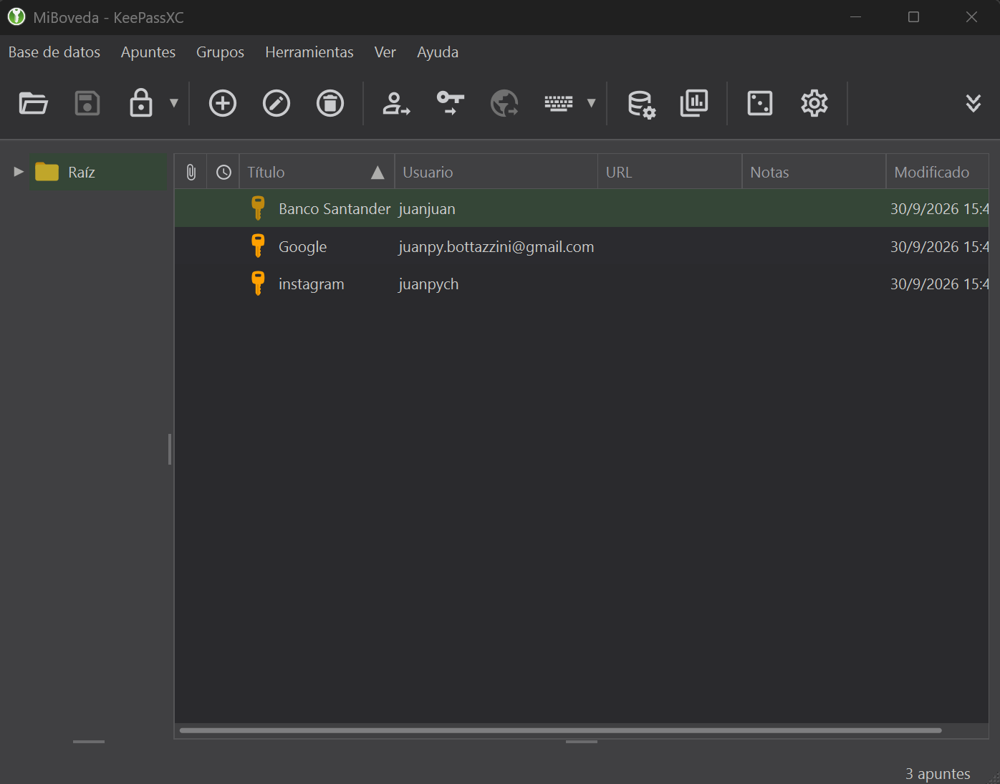
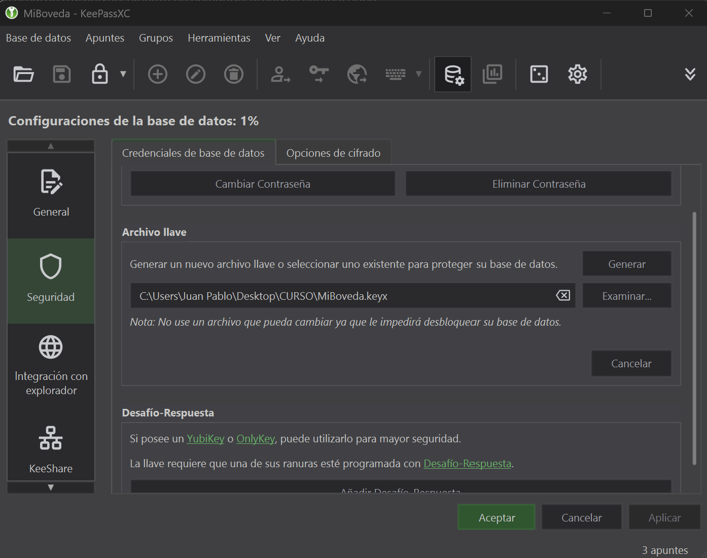
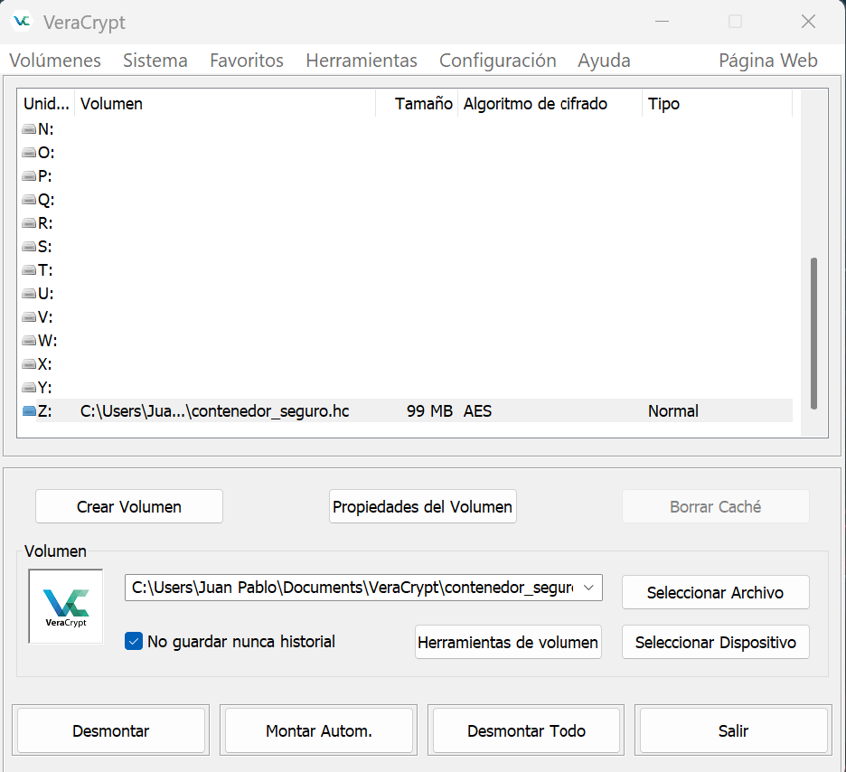

# Práctica: Mi Bóveda y Contenedor Seguro

**Módulo:** Criptografía Práctica y Gestión de Identidad
**Autor:** Juan Pablo Bottazzini
**Herramientas:** KeePassXC (gestor local) + VeraCrypt (cifrado de volúmenes)

## Objetivo

Construir un entorno donde:

- Mis **accesos** estén protegidos en una bóveda cifrada con **dos factores**: frase de contraseña (algo que sé) + archivo llave (algo que tengo).
- Mis **archivos sensibles** queden en un contenedor cifrado que es ilegible sin su contraseña, aunque alguien tenga acceso físico a mi computadora.

## Por qué KeePassXC

Elegí KeePassXC por su enfoque **local-first**: la base de datos (`.kdbx`) vive en mi equipo y no depende de servidores de terceros. La contrapartida es que soy responsable de respaldar tanto el `.kdbx` como el archivo llave.

---

## Paso 1: Bóveda de identidad (KeePassXC)

1. Instalé KeePassXC desde [keepassxc.org](https://keepassxc.org/download/).
2. **Base de datos → Nueva base de datos**, nombre `MiBoveda`.
3. **Configuración de cifrado:** dejé los valores por defecto (AES-256 / ChaCha20 con KDF Argon2d) y ajusté el tiempo de descifrado a ~1 s para encarecer los ataques de fuerza bruta.
4. **Contraseña maestra:** una frase de 5 palabras aleatorias generada con el generador de frases de KeePassXC (pestaña *Passphrase*). No se incluye aquí.
5. **Archivo llave (Key File):** en *Base de datos → Seguridad → Credenciales de base de datos → Añadir protección adicional → Archivo llave → Generar*. Lo guardé como `MiBoveda.keyx`. Buena práctica: mantenerlo **separado** del `.kdbx` (por ejemplo en un pendrive) y con una copia de respaldo.
6. **Registros cargados**, todos con contraseñas del generador de **20 caracteres** con mayúsculas, minúsculas, números y símbolos:

| Título | Longitud |
|---|---|
| Banco Santander | 20 |
| Google | 20 |
| Instagram | 20 |

> Importante: la contraseña del contenedor VeraCrypt debe guardarse en la bóveda **antes** de desmontar el volumen; si se olvida, los datos son irrecuperables.

### Evidencias

**Lista de cuentas en la bóveda** (sin mostrar contraseñas):

**Protección adicional activa (contraseña + archivo llave):**

---

## Paso 2: Contenedor cifrado (VeraCrypt)

1. **Create Volume → Create an encrypted file container → Standard VeraCrypt volume.**
2. Ubicación: `Documentos\VeraCrypt\contenedor_seguro.hc`
3. Tamaño: **100 MB**.
4. Cifrado: **AES** · Hash: **SHA-512** (valores por defecto). Observé que también ofrece Serpent, Twofish, Camellia y combinaciones en cascada (p. ej. AES-Twofish-Serpent), y hashes como Whirlpool, SHA-256 y Streebog.
5. Contraseña: una frase distinta a la de la bóveda, guardada en KeePassXC.
6. Formateo: sistema de archivos FAT, moviendo el ratón hasta completar la barra de aleatoriedad (entropía) y luego **Format**.

## Paso 3: Uso

1. **Montar:** letra `Z:` → *Select File* → `contenedor_seguro.hc` → **Mount** → contraseña.
2. **Acción:** dentro de `Z:` creé [`aprendizajes.txt`](aprendizajes.txt) (en este repo va una copia del contenido).
3. **Desmontar:** **Dismount** → la unidad `Z:` desaparece del explorador y el archivo solo existe cifrado dentro del `.hc`.

### Evidencia

**Volumen montado en `Z:`:**

> Nota: KeePassXC y VeraCrypt bloquean por defecto las capturas de pantalla de sus ventanas (protección contra malware que espía la pantalla). Para esta práctica las habilité temporalmente y luego las volví a activar.

---

## Qué NO está en este repositorio (a propósito)

El `.gitignore` excluye `*.kdbx`, `*.keyx`/`*.key` y `*.hc`. Aunque estén cifrados, subir la bóveda, el archivo llave o el contenedor a un repositorio público le daría a un atacante material para intentar fuerza bruta sin límite. Tampoco se muestran contraseñas reales en las capturas.

## Plan de recuperación

- Copia del archivo `.kdbx` en un segundo dispositivo.
- Copia del archivo llave en un pendrive guardado aparte (sin él, la bóveda no se abre aunque sepa la contraseña).
- La frase maestra solo en mi memoria + una copia en papel en un lugar seguro.

## Aprendizajes clave

1. **Un gestor elimina la reutilización de contraseñas:** solo recuerdo una frase maestra fuerte y el generador crea claves únicas y largas para cada sitio.
2. **MFA combina factores distintos:** en KeePassXC, contraseña (algo que sé) + archivo llave (algo que tengo); robar solo uno no alcanza. Para cuentas online, TOTP o llaves FIDO2 son mucho mejores que SMS.
3. **Las Passkeys y el cifrado de volúmenes protegen donde las contraseñas fallan:** una passkey está atada al dominio real (inmune al phishing) y un contenedor VeraCrypt deja mis archivos ilegibles aunque roben la computadora, siempre que no pierda la contraseña.
